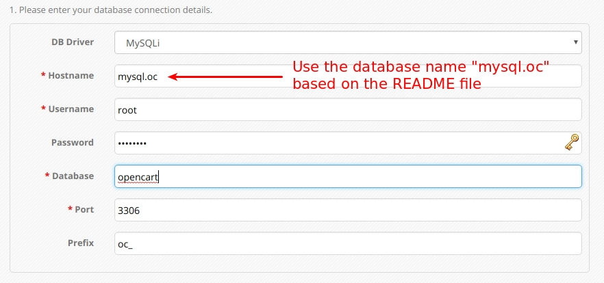

# Opencart Docker Image

The opencart is not prepared to create external volumes. This image can do it for you!

# Running for the first time:

Create a local directory to store your opencart data:

```bash
# Prepare the directory
mkdir ~/opencart
touch ~/opencart/config.php
touch ~/opencart/admin-config.php
sudo chown 65534:65534 -R ~/opencart

# Create a network
docker network create oc
```

After that you can create a MySQL container and the Opencart Container:

```bash
# Create a container mysql.
# Please do the necessary adjustments here
# More info: https://hub.docker.com/_/mysql
docker run -d --rm --name mysql \
     --network oc \
     -e MYSQL_ROOT_PASSWORD=password \
     -v ~/mysql-opencart:/var/lib/mysql \
     mysql:5.7

# Run the Opencart
docker run -d --rm --name opencart \
    --network oc \
    -p 80:80 \
    -v ~/opencart:/data \
    byjg/opencart:3.0.2.0
```

The first time you'll be in the installation process. The database name should be `mysql.oc`. Just to understand, 
the mysql is the name of the container and oc is the network. 




After finish the install please access the admin area. You'll receive a "Important Security Notification". Please
choose "Automatically Move" to the directory "/data/" as you can see below:


OK. 

Now you can stop your container and you don't lose your images. 

